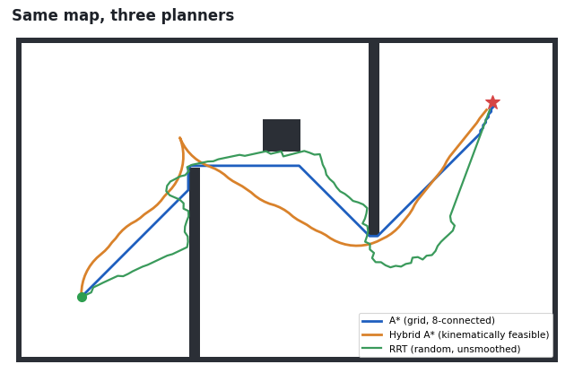
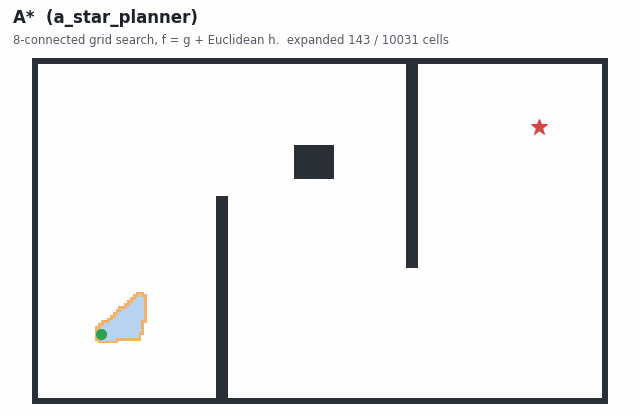
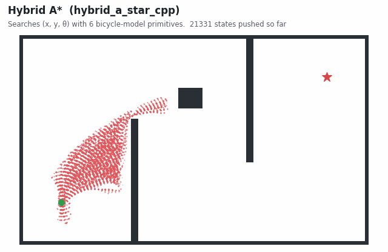
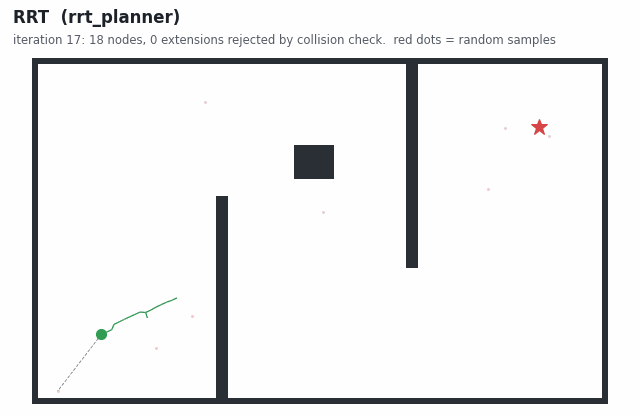

# ROS 2 Path Planning

Three path planners for a car-like robot, each written as a standalone ROS 2 C++ node:
**A\***, **Hybrid A\***, and **RRT**. They run against the
[F1TENTH simulator](https://github.com/f1tenth/f1tenth_gym_ros) topics: they read an occupancy grid
and the car's odometry, take a goal from RViz, and publish the path and the search state as RViz markers.



| Package | Executable | Algorithm | Drives the car? |
|---|---|---|---|
| [`a_star_planner`](a_star_planner/src/a_star_planner_node.cpp) | `a_star_node` | Grid A\* (4/8-connected) | Not yet. Stops at the goal, but path following is a TODO |
| [`hybrid_a_star_cpp`](hybrid_a_star_cpp/src/hybrid_a_star_node.cpp) | `hybrid_a_star_node` | Hybrid A\* with a bicycle model | Yes, with pure pursuit |
| [`rrt_planner`](rrt_planner/src/rrt_node.cpp) | `rrt_node` | RRT with goal bias | No, planning and visualization only |

---

## How each algorithm works

The animations below come from [`docs/visualize_planners.py`](docs/visualize_planners.py), a Python
port of each node's search loop. The port keeps the parameters, neighbour order, collision checks and
stop conditions from the C++ code. Only the 10 m × 6 m map and the start and goal are invented.

### A\*: `a_star_planner`



A\* searches the occupancy grid cell by cell. Every cell gets a score `f = g + h`, where `g` is the cost
so far (1 for a straight step, 1.414 for a diagonal one) and `h` is the straight-line distance to the goal.
The planner always expands the open cell with the lowest `f`. Blue cells in the animation are *closed*
(expanded) and the orange band is the *open list*. The heuristic pulls the search toward the goal, so
A\* only explores the part of the map that can still lead to a shorter path.

* The search runs in cell space, so the path is a chain of grid-cell centres. It is as short as possible,
  but it ignores the car's turning radius.
* Only cells with value `0` are traversable, and obstacles are not inflated. The shortest path therefore
  hugs wall corners, as the comparison image shows.
* Set the `heuristic_type` parameter to `manhattan` to use Manhattan distance, and `allow_diagonal: false`
  to restrict the search to 4 neighbours.

### Hybrid A\*: `hybrid_a_star_cpp`



Hybrid A\* applies the same best-first idea to the car's continuous pose `(x, y, θ)`. Each node has
**six motion primitives**: steer `-0.34`, `0` or `+0.34` rad, driving forward or in reverse, each for
`step_length = 0.1 m`. A kinematic bicycle model integrates every primitive:

```
θ' = θ + (dir · step / wheelbase) · tan(steer)
x' = x + dir · step · cos θ
y' = y + dir · step · sin θ
```

A child is rejected when any corner of the car's footprint (rear axle to `wheelbase` forward,
`width` wide) lands in an occupied or unknown cell. Closed states are deduplicated in 0.1 m × 0.1 m ×
0.1 rad bins. Every path the search returns is drivable with the car's steering limits. In exchange, it
expands far more states than grid A\*: the red cloud in the animation holds about a million states on this map.

When the planner finds a path, a **pure-pursuit** controller follows it. On each 50 ms tick it picks the
first path point at least `lookahead_distance` away and steers toward it:
`δ = atan(2 · L · sin α / lookahead)`.

* Reverse moves cost the same as forward ones, so a path can contain long reverse stretches (pink
  in the animation). The controller only drives forward, which means it cannot follow those stretches.
* The heuristic is plain Euclidean distance. It ignores obstacles and heading, which is why the search
  spreads so widely before it finds the route around the walls.

### RRT: `rrt_planner`



RRT (Rapidly-exploring Random Tree) grows a tree out from the start pose. Each iteration runs four steps:

1. **Sample** a point. 65% of the time the sample is the goal itself (goal bias). Otherwise it is a uniform
   random point on the map (the red dots).
2. Find the **nearest** tree node to the sample.
3. **Steer** from that node at most 0.1 m toward the sample (the dashed line).
4. Check the new edge with a **Bresenham line**. If it crosses no occupied cell, add the new node to the tree.

The search stops once a node lands within 0.15 m of the goal, or after 5000 iterations. RRT never
expands a grid, so it scales well to large maps. The cost is that the path is random and jagged and
nowhere near the shortest. The high goal bias makes the tree rush at the goal, pile up against walls,
and depend on the random samples to get around them. Different random seeds give different paths.

---

## Requirements

* ROS 2 (Humble or newer) on Ubuntu
* Packages: `rclcpp`, `nav_msgs`, `geometry_msgs`, `visualization_msgs`, `tf2_ros`, `tf2_geometry_msgs`,
  and `ackermann_msgs` (A\* and Hybrid A\* only)
* A simulator or robot that publishes the topics listed below. The F1TENTH `f1tenth_gym_ros` bridge
  publishes all of them.

The `package.xml` files don't declare dependencies yet, so `rosdep install` won't find them. Install
the dependencies by hand:

```bash
sudo apt install ros-$ROS_DISTRO-ackermann-msgs ros-$ROS_DISTRO-tf2-geometry-msgs ros-$ROS_DISTRO-visualization-msgs
```

## Build

The repository root is the colcon workspace:

```bash
git clone <this repo> ros2_path_planning
cd ros2_path_planning
source /opt/ros/$ROS_DISTRO/setup.bash
colcon build
source install/setup.bash
```

To build a single package, add `--packages-select a_star_planner`.

## Run

1. Start the simulator, which also starts the map server and RViz in `f1tenth_gym_ros`.
2. Start **one** planner. A\* and Hybrid A\* publish on the same topics, so don't run them together.

   ```bash
   ros2 run hybrid_a_star_cpp hybrid_a_star_node
   ```
   ```bash
   ros2 run a_star_planner a_star_node --ros-args -p heuristic_type:=manhattan
   ```
   ```bash
   ros2 run rrt_planner rrt_node
   ```
3. In RViz, use **2D Goal Pose** to send a goal on `/goal_pose`.
4. Add `Marker` displays for the topics below to watch the planner work.

## Interfaces

### Subscribed (all nodes)

| Topic | Type | Notes |
|---|---|---|
| `/map` | `nav_msgs/OccupancyGrid` | Planning map |
| `/ego_racecar/odom` | `nav_msgs/Odometry` | Transformed into the `map` frame with TF |
| `/goal_pose` | `geometry_msgs/PoseStamped` | Planning starts when a goal arrives (RRT replans continuously; see below) |

### Published

| Topic | Node | Type | What it shows |
|---|---|---|---|
| `/drive` | A\*, Hybrid A\* | `ackermann_msgs/AckermannDriveStamped` | Steering and speed commands (A\* only sends a stop at the goal) |
| `/path` | A\*, Hybrid A\* | `Marker` (line strip) | Planned path |
| `/expanded_nodes` | Hybrid A\* | `Marker` (sphere list) | Every state pushed during the search |
| `/open_list`, `/closed_list` | A\* | `Marker` | Declared, not populated yet |
| `/planning_status` | A\*, Hybrid A\* | `Marker` (text) | Status text above the car |
| `/rrt/nodes`, `/rrt/edges` | RRT | `Marker` | The tree |
| `/rrt/samples` | RRT | `Marker` (sphere list) | All sampled points |
| `/rrt/path`, `/rrt/status` | RRT | `Marker` | Path and success or failure text |

### Parameters

**`a_star_planner`**

| Name | Default | Description |
|---|---|---|
| `heuristic_type` | `euclidean` | `euclidean` or `manhattan` |
| `allow_diagonal` | `true` | Use 8-connected neighbours when true, 4-connected when false |
| `goal_tolerance` | `0.3` | Distance (m) at which the car counts as arrived |
| `lookahead_distance`, `speed` | `0.5`, `1.5` | Reserved for the pure-pursuit controller (not used yet) |

**`hybrid_a_star_cpp`**

| Name | Default | Description |
|---|---|---|
| `max_steering_angle` | `0.34` | rad, the steer value of the left and right primitives |
| `step_length` | `0.1` | m per motion primitive |
| `wheelbase` | `0.3302` | m, the F1TENTH car |
| `width` | `0.2032` | m, used for the collision footprint |
| `lookahead_distance` | `0.5` | m, pure-pursuit lookahead |
| `speed` | `2.0` | m/s, constant drive speed |
| `goal_tolerance` | `0.2` | m |

**`rrt_planner`**: the values are hard-coded in the `RRTNode` constructor, not exposed as ROS parameters:
step `0.1` m, goal tolerance `0.15` m, `5000` max iterations, goal bias `0.65`.

## Status and limitations

* **A\*** finds and publishes a path, but it doesn't follow it yet: the pure-pursuit step in
  `controlLoop()` is a TODO. The open and closed list markers aren't published yet either.
* **Hybrid A\*** paths can include reverse segments that the forward-only controller can't follow (see above).
* **RRT** replans from scratch on every 50 ms timer tick once it has a map, pose and goal, and logs each
  run at INFO level. It doesn't publish drive commands.
* None of the planners inflate obstacles or smooth their paths.

## Regenerating the animations

```bash
pip install numpy matplotlib pillow
python docs/visualize_planners.py
```

The script writes the GIFs and `comparison.png` to `docs/images/`. It takes about a minute, mostly spent
on Hybrid A\*. To try other layouts, edit `build_map()`, `START` or `GOAL`.
